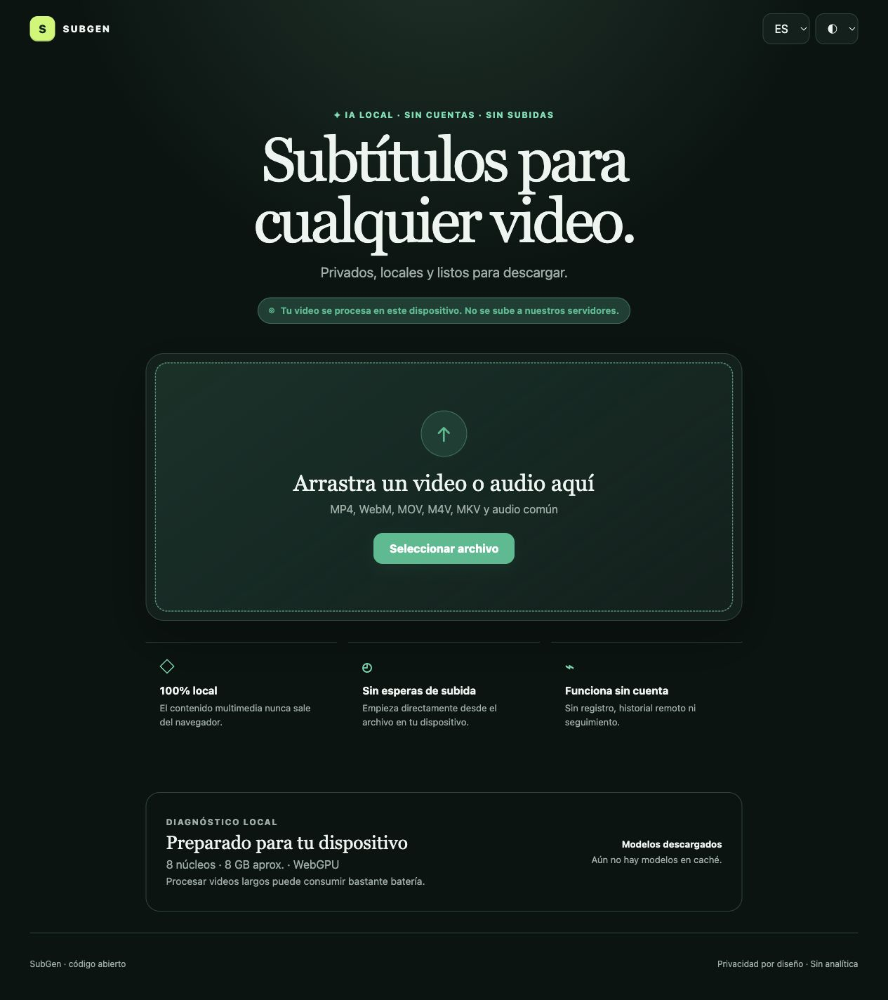

# SubGen

SubGen genera y traduce subtítulos directamente en el navegador. El video y el audio permanecen en el dispositivo: no hay backend, cuentas, analítica ni API de pago.



> Estado: V1 funcional. Transcripción Whisper multilingüe, traducción inglés→español, SRT original/traducido/bilingüe, editor, cancelación y caché local verificados en Chromium.

## Demo

[Abrir SubGen en producción](https://subgen-e93.pages.dev/). El proyecto también funciona localmente con los comandos de abajo.

## Características

- Selección y drag-and-drop de video o audio.
- Extracción con APIs nativas; fallback local mediante `ffmpeg.wasm` para contenedores/codecs no decodificados por el navegador.
- Whisper multilingüe local con WebGPU y fallback WASM/CPU.
- Traducción local inglés→español mediante OPUS-MT/Marian.
- Salida original, española o bilingüe; editor previo y descarga UTF-8 `.srt`.
- Progreso por estados reales, progreso cuantificable de descargas y cancelación que termina workers.
- Detección de WebGPU real mediante adaptador, WASM, workers, núcleos, memoria aproximada y cuota de almacenamiento.
- Modelos cargados bajo demanda, Cache Storage, inventario y borrado explícito.
- Español e inglés, temas claro/oscuro/sistema, responsive y PWA parcial.
- Sin base de datos, login, cookies de seguimiento ni telemetría.

## Privacidad

Los bytes multimedia se procesan en el navegador. Solo se hacen solicitudes de red para descargar las dependencias de ejecución y pesos desde Hugging Face/jsDelivr en la primera ejecución; Transformers.js los guarda en Cache Storage. No se transmiten nombres, audio, video ni subtítulos.

## Arquitectura

```text
Archivo local → AudioContext (ffmpeg.wasm si hace falta) → Float32 16 kHz mono
             → Web Worker → Whisper ONNX → segmentos + timestamps
             → liberar Whisper → OPUS-MT ONNX → texto español
             → normalizador SRT → editor → Blob descargable
```

La UI permanece en el hilo principal; inferencia y fallback multimedia usan workers. No existe backend. Consulta [docs/architecture.md](docs/architecture.md) y [docs/research.md](docs/research.md).

## Modelos

| Uso   | Modelo/revisión fijada                  | Variante             |                      Descarga mostrada | Licencia                  |
| ----- | --------------------------------------- | -------------------- | -------------------------------------: | ------------------------- |
| ASR   | `onnx-community/whisper-tiny@ff417702…` | multilingüe, q4/fp16 |     ~72–94 MB usados según dispositivo | MIT (modelo base Whisper) |
| EN→ES | `Xenova/opus-mt-en-es@4b002a4…`         | Marian q4            | ~122 MB estimados de pesos principales | Apache-2.0 (modelo base)  |

La caché completa observada durante la prueba real fue de 388 MB porque incluye tokenizadores, configuración, ONNX Runtime y artefactos de ambos modelos. Las estimaciones de UI describen pesos principales, no prometen consumo final exacto.

## Requisitos y navegadores

- Node.js 20.19+ y pnpm 11 para desarrollar.
- En producción: navegador con WebAssembly y Web Workers.
- WebGPU mejora el rendimiento, pero no es obligatorio.

| Navegador                                   | Estado real                                                            |
| ------------------------------------------- | ---------------------------------------------------------------------- |
| Chromium desktop (Codex in-app, 19-08-2026) | ✅ ASR + traducción + descarga real verificadas                        |
| Chromium móvil (emulación Pixel 7)          | ✅ flujo E2E y responsive verificados; inferencia física no verificada |
| Edge desktop                                | No verificado                                                          |
| Chrome Android físico                       | No verificado                                                          |
| Safari macOS                                | No verificado                                                          |
| Safari iOS/iPadOS                           | No verificado; WebGPU/WASM y memoria pueden limitarlo                  |
| Firefox                                     | No verificado; se espera fallback WASM cuando sea viable               |

La compatibilidad de MP4/MOV/WebM/audio depende de los codecs que el navegador pueda decodificar. MKV y otros casos usan ffmpeg.wasm, que necesita copiar el archivo a su sistema de archivos en memoria.

## Desarrollo

```bash
pnpm install
pnpm dev
```

Build y previsualización:

```bash
pnpm build
pnpm preview
```

## Pruebas

```bash
pnpm lint
pnpm typecheck
pnpm test
pnpm exec playwright install chromium
pnpm test:e2e
pnpm check
```

El E2E usa un adaptador determinista activado únicamente por `VITE_E2E_MODE=true` en el servidor Playwright. El build normal no activa ese camino. La integración real se verificó manualmente con una voz sintética legal de 4 segundos: Whisper produjo dos segmentos correctos y OPUS-MT los tradujo al español; la ejecución con modelos cacheados se observó completa en ≤16,7 s en el entorno de prueba. Consulta [docs/benchmarks.md](docs/benchmarks.md).

## Hosting

El artefacto `dist/` es estático y contiene `_headers`/`_redirects` para Cloudflare Pages. Configuración:

- comando: `pnpm build`
- directorio: `dist`
- Node: 22
- variables/secretos: ninguno

Cloudflare Pages Free mantiene solicitudes de assets estáticos gratuitas e ilimitadas; actualmente permite 500 builds/mes, 20.000 archivos y 25 MiB por asset. El asset mayor de este build es el WASM de ONNX Runtime (~22,5 MiB), dentro del límite.

Para un dominio propio: añádelo en **Workers & Pages → SubGen → Custom domains** y aplica el registro DNS indicado por Cloudflare. No es necesario modificar la app, salvo actualizar `canonical`, `robots.txt` y `sitemap.xml`.

## Limitaciones conocidas

- Primera ejecución: descarga grande y necesita internet. Tras cachear shell, runtime y modelos, el flujo puede funcionar sin conexión, sujeto a que el navegador no haya purgado la caché.
- Archivos grandes: AudioContext y ffmpeg.wasm pueden mantener copias completas en memoria. SubGen avisa según memoria/núcleos, pero no impone un límite falso.
- Traducción V1: inglés→español. Para otros idiomas, descarga el original.
- Whisper Tiny prioriza tamaño/velocidad; no iguala modelos grandes en ruido, acentos difíciles o diálogos superpuestos.
- No hay identificación de speakers, timestamps por palabra, VTT/ASS ni procesamiento batch en V1.

## Troubleshooting

- **Sin memoria:** usa modelo Ligero, un archivo más corto y cierra otras pestañas.
- **Codec no compatible:** convierte a MP4 H.264/AAC, WebM o WAV.
- **Modelo no descarga:** comprueba red, cuota de almacenamiento y que `huggingface.co`/`cdn.jsdelivr.net` no estén bloqueados.
- **Caché dañada:** usa “Liberar modelos” y vuelve a procesar.
- **Safari/iPhone:** prueba un audio corto; si falla, usa Chromium de escritorio. No afirmamos compatibilidad no verificada.

## Seguridad y licencias

Dependencias fijadas y lockfile, CSP, headers defensivos, Dependabot y auditoría CI. Consulta [SECURITY.md](SECURITY.md) y [THIRD_PARTY_NOTICES.md](THIRD_PARTY_NOTICES.md).

El código de SubGen se publica bajo MIT. Los componentes de terceros conservan sus licencias; en particular, el core remoto `@ffmpeg/core` es GPL-2.0-or-later.

## Roadmap

VTT/ASS, importar/traducir SRT, edición avanzada, speakers, timestamps por palabra, burn-in, desktop/móvil nativo, batch y un backend opcional explícito para dispositivos no compatibles.

## Contribuir

Consulta [CONTRIBUTING.md](CONTRIBUTING.md). Los reportes de seguridad siguen [SECURITY.md](SECURITY.md).
